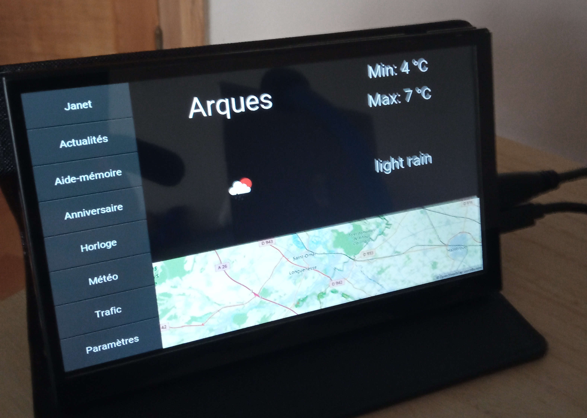

# Ordo

Ordo est une application Kivy permettant de gérer plusiuers applications en une seule et est adapté particulièrement pour des supports tactiles.



## Architecture du projet

Dans le dossier ordo, deux dossiers sont parmi les plus importants : 

- parameters : contient le fichier de paramètres ordo.json pour configurer la taille de l'écran approprié ainsi que les plugins à installer dans l'ordre prédéfini.

Exemple : 

```
{
    "show_cursor":true,
    "resizable":false,
    "fullscreen":false,
    "width":1024,
    "height":600,
    "plugins" : ["plugin_1", "plugin_2", "plugin_3"]
}
```

- plugins : Contient l'ensemble des plugins à ajouter. Un formalisme doit être respecté pour chacun des plug-ins (des exemples sont à venir)

## Commandes

il est nécessaire d'avoir poetry installé sur votre machine et d'être sur le dossier ordo de votre application.

### Lancer l'application.

```
poetry run python main.py
```

### Désinstaller un plugin

```
poetry run uninstall nom_de_mon_plugin
```

Il est recommandé de ne pas supprimer le dossier du plugin manuellement afin de nettoyer également les librairies nécessaires uniquement au plugin à supprimer.

## Liste de plugins disponibles

| Nom | Description |
|------------|------------------------------------------------------|
| [ordo_clock](https://github.com/juliengabryelewicz/ordo_clock) | Application permettant d'afficher la date et l'heure |
| [ordo_map](https://github.com/juliengabryelewicz/ordo_map) | Application permettant d'afficher la météo de la ville de votre choix |
| [ordo_news](https://github.com/juliengabryelewicz/ordo_news) | Application permettant d'afficher le contenu des flux RSS |
| [ordo_paint](https://github.com/juliengabryelewicz/ordo_paint) | Application permettant de dessiner avec vos doigts sur un écran tactile |